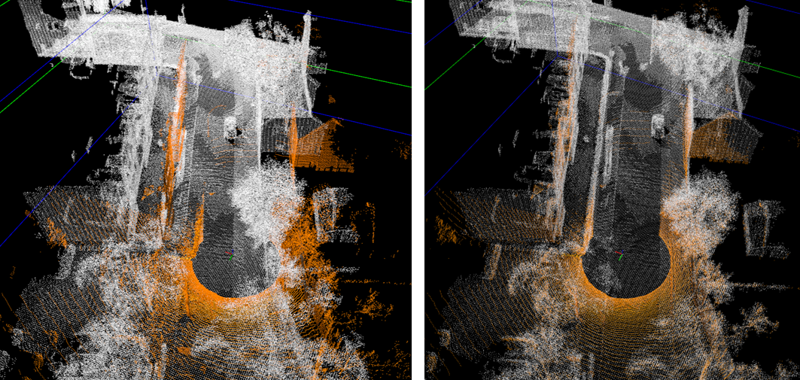

[](./notes/animation.gif) |

# GeoNavPCR: Using point cloud registration algorithms to improve the navigation solutions of mobile mapping vehicles. 

## Introduction

This GitHub page is consisting of the code that lays the basis for the master thesis: Using point Cloud registration to improve a navigation solution: an experimental approach.

Taken from the thesis to establish context for the code:

"The first research question is based on analysing if PCR can be used to align a
georeferenced source point cloud with a raw target point cloud. The alignment of
point clouds will establish a new centre point of the target point cloud. This is also
the centre of the navigation solution. The centre point of the navigation solution will,
after the alignment, be a closer approximation of the ground truth.

The second research question establishes a quality measure of a mobile mapping project
by analysing the quality of the navigation solution, where the goal is to contribute
a quality measure of the absolute accuracy of a mobile mapping project when the
accuracy is poor or unknown."


The goal of the thesis has been to establish a consistent way of using point cloud registration to establish an absolute position by aligning it with a georeferenced point cloud.

Furthermore, the following are the research questions that are used in the thesis:

* Can PCR improve the absolute accuracy of a mobile mapping LiDAR point cloud by aligning it with an existing georeferenced point cloud? 

* Can the predicted trajectory improved with PCR be used as a viable quality measure of a navigation solution?


# Running the code

## Requirements

This code is implemented with python 3.8 and the requierments for the code can be found in the file requirements.txt

As well as the requirements, the teapot-library was used. Forked the 19.01.23 with commit: f1e8d6ba6d9a0003ecc4630a878518c3778dabf. This is available at: IsakIngebrigtsen/teapot-lidar
The teapot-library should be pulled, and the path needs to be added to line 421 in ```absolute_navigatior_ICP.py```

All data used in this thesis are available at https://drive.google.com/drive/folders/1SnkDh-X8KOc1iNNy_-xhMAyngN93VshZ
This should be downloaded on the same format for easy running of the code

## Changing the input parameters
The script ```absolute_navigatior_ICP.py``` is the main script, and is the basis for all the results in this thesis.

From line 415, to line 436 are inputs that can be changed to gain different results in the program
```
    # Inputs for the data!
    voxel_size = 0.5  # means 50cm for this dataset
    # Data path to the data ran in this program. use the structure from
    data_path = 'C:\\Users\\isakf\\Documents\\1_Geomatikk\\Master\\Data\\'
    # Path to teapot_lidar project. Code forked with the hash f1e8d6ba6d9a0003ecc4630a878518c3778dabf4, with some minor
    # adjustments. Version used can be pulled from https://github.com/IsakIngebrigtsen/teapot-lidar
    data_path_teapot_lidar = "C:\\Users\\isakf\\Documents\\1_Geomatikk\\Master\\master_code\\Master_thesis\\teapot_lidar"
    Area = "Lillehammer"
    system_folder = "Round1"  # ETPOS system folder is the same dataset as the referance point cloud. PPP is a different round.
    section = "Full"  # Full, Forest, Rural, Dense
    number_of_files = 1
    file_list = get_files(18, number_of_files, system_folder)  # the files from the 10th file and 5 files on # Take file nr. 17 next.
    from_frame = 10
    to_frame = 20
    skips = 4
    handle_outliers = True  # If True, the outliers get removed.
    algorithm = "Point2Plane"  # It is possible to change between Point-to-Point and Point-To-Plane
    sbet_process = "PPP"  # Choose between SBET_prosess "PPP" or "ETPOS"
    standalone = True  # if True a 1.5 meters deviation is added to the sbet data.
    save_data = True  # True and the data gets saved
    print_point_cloud = True  # True, and every PCR alignment gets printed as visualisations
```


